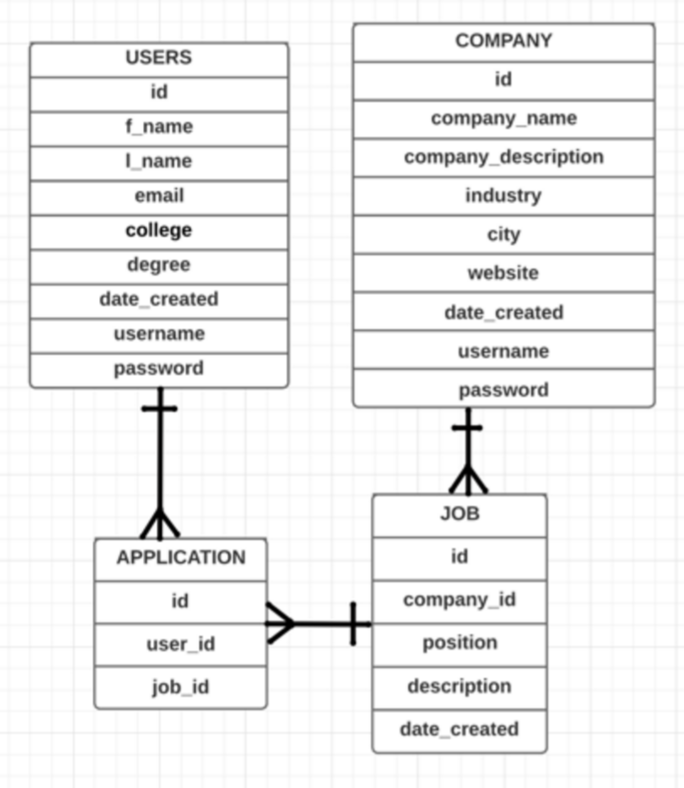

# Alarina 

## US Job Seeking App for International Students

## Concept

A full-stack web application that will assist recent college graduates in the US to search for companies that provide visa sponsorship in both full-time and part-time jobs. This web application not only helps bridge the gap for international students who are searching for employment in the US but also saves tremendous time searching for job postings with sponsorships.

'Alarina' means liaison in Yoruba.

##Technology
- Node.js
- Express.js
- REACT.js
- React Router
- PSQL
- Webpack
- HTML/CSS
- Javascript
- Heroku

## User Flow

## User Stories
Each year, hundreds of thousands of International students graduate from colleges and universities with 12 months of OPT before they have to find an H-1B to stay in the US. In order to alleviate the stress, recent graduates and companies can now utilize this web application to view, create, update, and/or delete various job postings (all posts with sponsorships).

## Wireframes - Initial Stage

## ERD

## Alarina App Idea Inspiration
- ZipRecruiter: https://www.ziprecruiter.com/
- Betterteam: https://www.betterteam.com/job-posting-sites
- Snagajob: http://www.snagajob.com/
- Upwork: https://www.upwork.com/

## Alarina App
https://alarina.herokuapp.com/

